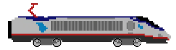

# Colt Express with Tkinter Python

### Project theme:
This project invites you to build an electronic and somewhat simplified version of the Colt Express game by Python.

#### Overview of game rules:

The game takes place on board a train, consisting of a locomotive and a number of equal carriages
to the number of players. Players embody bandits who have jumped on board to rob the
passengers. Objective: collect as much loot as possible, each for himself. This is a game of
programming, in which one alternates between two phases:

- Planning: each player secretly decides on a certain number of actions, which his
character will perform in order.

- Action: perform all the actions number 1, then all the number 2, and this until the
end.

The bandits can be in the wagons or the locomotive, and for each of these elements
either indoors or on the roof. In this statement, by abuse of language, we will designate by car a
any element of the train, which may be the locomotive. The possible actions for bandits are:

- Move one car forwards or backwards, staying on the same floor.

- Go inside or climb onto the roof of their current wagon.

- Rob a traveler to collect loot (or simply loot loot that has been
left there).

- Shoot another nearby bandit to make him drop his loot.
The loot recoverable on board the train are:

- Purses worth €100 or €200, from passengers, inside the wagons.

- Jewelry worth €500, from passengers, inside the wagons.

- A hoard worth €1000, inside the locomotive, in the custody of the Marshall.
A Marshall is present on board the train and can move between the locomotive and the wagons,
always staying inside. He shoots at all the bandits who are in the same position as him and
forced to take refuge on the roof.

_Paris 8 University_

_2nd year Bachelor of Computer Science_

_Subject: Programming of interfaces_

-----------------------------------

       

# Colt Express avec Tkinter Python

### Thème du projet :
Ce projet vous invite à construire une version électronique et quelque peu simplifiée du jeu Colt Express de Python.

#### Aperçu des règles du jeu:
Le jeu se déroule à bord d’un train, composé d’une locomotive et d’un certain nombre de wagons égal
au nombre de joueurs. Les joueurs incarnent des bandits qui ont sauté à bord pour détrousser les
passagers. Objectif: récupérer le plus de butin possible, chacun pour soi. Il s’agit d’un jeu de
programmation, dans lequel on alterne entre deux phases :

- Planification : chaque joueur décide secrètement un certain nombre d’actions, que son
personnage va effectuer dans l’ordre.

- Action : on effectue toutes les actions numéro 1, puis toutes les numéro 2, et ce jusqu’au
bout.

Les bandits peuvent se trouver dans les wagons ou la locomotive, et pour chacun de ces éléments
soit à l’intérieur soit sur le toit. Dans cet énoncé, par abus de langage on désignera par wagon un
élément quelconque du train, qui peut être la locomotive. Les actions possibles pour les bandits sont :

- Se déplacer d’un wagon en avant ou en arrière, en restant au même étage.

- Aller à l’intérieur ou grimper sur le toit de leur wagon actuel.

- Braquer un voyageur pour récupérer du butin (ou simplement récupérer un butin qui a été
abandonné là).

- Tirer sur un autre bandit proche pour lui faire lâcher son butin.
Les butins récupérables à bord du train sont :

- Des bourses valant 100€ ou 200€, auprès des passagers, à l’intérieur des wagons.

- Des bijoux valant 500€, auprès des passagers, à l’intérieur des wagons.

- Un magot valant 1000€, à l’intérieur de la locomotive, sous la garde du Marshall.
Un Marshall est présent à bord du train et peut se déplacer entre la locomotive et les wagons, en
restant toujours à l’intérieur. Il tire sur tous les bandits qui se trouvent à la même position que lui et les
force à se retrancher sur le toit.

_Université Paris 8_

_2 ème année Licence Informatique_

_Matière: Programmation d’interfaces_

